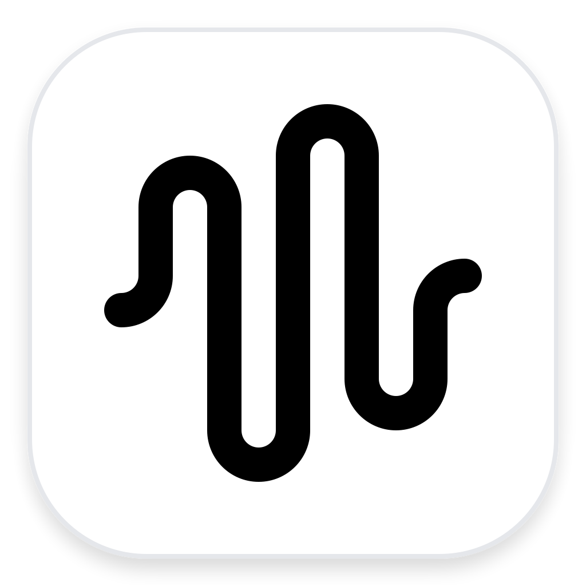

<p align="center">
  
</p>

<h1 align="center">OnSpeak</h1>

<p align="center">
  Clean, fast, on-device dictation for macOS.
</p>

<p align="center">
  <a href="https://rushi-is-a.live">Website</a>
</p>

## Install

```bash
curl -L -o /tmp/OnSpeak.dmg https://github.com/hrushikesh-thorat/onspeak/releases/latest/download/OnSpeak.dmg && xattr -c /tmp/OnSpeak.dmg && hdiutil attach /tmp/OnSpeak.dmg -nobrowse -mountpoint /tmp/onspeak-dmg -quiet && rm -rf /Applications/OnSpeak.app && ditto /tmp/onspeak-dmg/OnSpeak.app /Applications/OnSpeak.app && hdiutil detach /tmp/onspeak-dmg -quiet && rm /tmp/OnSpeak.dmg && open /Applications/OnSpeak.app
```

The first release is ad-hoc signed. The command clears the downloaded DMG's quarantine attribute before installing OnSpeak.

## What OnSpeak does

Hold a shortcut, speak, and release. OnSpeak transcribes while you talk, performs a conservative local cleanup pass, and pastes the result at your cursor.

The normal dictation path is deliberately small:

```text
Microphone → Apple SpeechAnalyzer → deterministic cleanup → clipboard/paste
```

There is no transcription account or API key. OnSpeak does not capture your screen and does not require Screen Recording permission.

## Why Apple SpeechAnalyzer

Apple's [SpeechAnalyzer documentation](https://developer.apple.com/documentation/speech/speechanalyzer) describes a native asynchronous pipeline for live or recorded audio, with `SpeechTranscriber` producing results and `AssetInventory` managing the required language assets. That maps directly to a lightweight Mac dictation app: audio can be streamed into the analyzer as it arrives, and the operating system manages the speech model.

There is also encouraging independent evidence. [Inscribe's SpeechAnalyzer benchmark](https://get-inscribe.com/blog/apple-speech-api-benchmark.html), independently [covered by MacGeneration](https://www.macg.co/macos/2026/07/speechanalyzer-un-benchmark-confirme-que-la-transcription-dapple-bat-le-whisper-dopenai-309741), measured 5,559 LibriSpeech utterances fully on-device. It reported lower word error rates for SpeechAnalyzer than Whisper Small and roughly three-times-faster processing on the tested M2 Pro.

That benchmark is useful evidence, not a universal guarantee: it covers English read speech on one machine, not every language, accent, microphone, or conversational environment.

## Features

- **On-device transcription:** Apple SpeechAnalyzer and SpeechTranscriber process dictation locally.
- **Streaming results:** Audio is sent to the analyzer while you speak, reducing the work left after release.
- **Hold or toggle shortcuts:** Configure separate hold-to-talk and tap-to-toggle shortcuts.
- **Safe local cleanup:** Removes obvious fillers, repeated words, stutter fragments, extra whitespace, and punctuation spacing without semantic rewriting.
- **Custom vocabulary:** Preserve names and technical terms, including explicit `spoken -> replacement` corrections.
- **Paste again and history:** Quickly reuse recent dictation without recording it again.
- **Microphone selection:** Choose a specific input or follow the system default.
- **Native menu-bar UI:** OnSpeak stays out of the way until you need it.

## Privacy and permissions

OnSpeak's transcription and cleanup path runs on your Mac. Recorded audio and transcripts are not sent to an OnSpeak server.

The app requests only the permissions needed for dictation:

- **Microphone** to record your voice.
- **Speech Recognition** to use Apple's speech framework.
- **Accessibility** to observe the focused text target and paste the finished transcript.
- **Input Monitoring** to detect your chosen global dictation shortcuts, including modifier-only shortcuts such as Fn or Right Option. OnSpeak does not record or store the keys you type.

OnSpeak does not request Screen Recording access and does not take screenshots.

## Requirements

- macOS 26 or later.
- Hardware and language supported by Apple's `SpeechTranscriber`.
- Xcode 26 and the macOS 26 SDK when building from source.

Speech assets for a selected language are downloaded and managed through Apple's `AssetInventory` when required.

## Build from source

```bash
make
make test
make run
```

The app bundle is built as `build/OnSpeak.app` with bundle identifier `com.rushatpeace.onspeak`.

## Project principles

- Keep the primary workflow local and fast.
- Prefer native platform APIs over bundled infrastructure.
- Make cleanup predictable and meaning-preserving.
- Request the fewest permissions possible.
- Keep the interface understandable without documentation.

## License

OnSpeak is licensed under the MIT License. See [THIRD_PARTY_NOTICES.md](THIRD_PARTY_NOTICES.md) for incorporated open-source components and their licenses.
